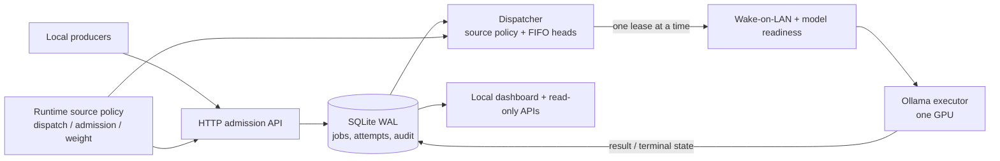

# Ollama Inference Broker / Брокер инференса Ollama

[English](#english) · [Русский](#russian)

<a id="english"></a>
## English

A local admission and scheduling service for one Ollama GPU executor. It keeps jobs in a durable SQLite WAL queue, runs at most one inference job at a time, and keeps model selection and limits on the server side. It does not replace Ollama or route cloud workloads.

<a id="architecture"></a>
### Architecture



The broker and SQLite queue live on an always-on host; the Ollama executor may sleep. Wake-on-LAN, model readiness, unload/load, and inference happen only when dispatch is enabled and an eligible job is selected. `GET /healthz` does not contact the executor.

With a runtime source policy, the scheduler takes the oldest eligible job from each source, groups ready source/model lanes into contiguous model-aware batches, and allocates a recurring 60-minute execution-time horizon in **direct proportion** to their positive weights. Jobs are non-preemptive, so a final job may exceed its lane's budget. A source that becomes ready mid-cycle receives a share of the remaining horizon. Without a policy, eligible jobs use global FIFO.

### Local start (admission only)

Python 3.11+ is required. Copy `config/local.example.json` to `config/local.json`, set `ollama_url` to the executor's reachable HTTP origin and `mainpc_mac` to its Wake-on-LAN MAC, then restrict the file to the owner. The broker reads this untracked file at startup, even in admission-only mode. No wake or Ollama request is made while dispatch is disabled. There is no localhost fallback for the executor.

```bash
cp config/local.example.json config/local.json
# Edit config/local.json for your executor before starting.
chmod 600 config/local.json
BROKER_DISPATCH_ENABLED=false BROKER_DB=./broker.sqlite3 python3 -m broker
```

In another terminal:

```bash
curl --fail http://127.0.0.1:8088/healthz
```

The API binds to `127.0.0.1:8088` by default. Keep it on a trusted local interface: legacy job APIs are not a public authentication boundary. The supplied systemd units are templates: create owner-only `~/.config/ollama-inference-broker/broker.env` (and `report.env` if using the report timer) for other deployment settings before installing them. The broker and reporter read `config/local.json` beside the deployed source; `OLLAMA_URL` and `MAINPC_MAC` override its broker values, and `BROKER_OLLAMA_URL` overrides its reporter URL. Set `WOL_BROADCAST` separately if needed. Dispatch is disabled in the broker template until explicitly enabled.

### Key contracts

- `POST /v1/jobs` durably admits a server-owned profile and returns HTTP 202. `GET /v1/jobs/{id}` and `POST /v1/jobs/{id}/cancel` expose the job lifecycle.
- `/api/chat` and `/api/generate` are admission-compatible endpoints, **not** direct Ollama streaming proxies. A streaming request returns an admission frame, not immediate model output.
- `GET /dashboard`, `GET /v1/dashboard`, `GET /v1/forecast`, `GET /v1/analytics`, and `GET /v1/audit-events` expose local operational views. Forecast is read-only and contingent, with 10 selections by default (maximum 20). Observer failure is reported as stale or unavailable, not as invented zeroes.
- `BROKER_DISPATCH_ENABLED=true` starts the dispatcher. Without `BROKER_SOURCES_POLICY`, an explicit `BROKER_DISPATCH_SOURCES` allowlist is required. With a policy, enabled sources form the dispatch allowlist.
- A policy source's `enabled=false` pauses new dispatch leases; `admission_allowed=false` rejects new jobs with HTTP 403 before insertion. The source controls API supports dispatch pause/resume, admission allow/block, weight changes, and confirmed bulk cancellation of queued or retry of failed jobs. Existing running work is not preempted.
- Producer-owned storage is opt-in per source and admission. Its status, receipt, and mutation APIs require an owner-only bearer token; legacy jobs keep their previous contract. Compaction requires explicit guards and a matching durable ACK. See [producer storage](docs/PRODUCER_STORAGE.md) and [analytics](docs/ANALYTICS.md).

An illustrative **non-production** policy:

```json
{
  "version": 1,
  "sources": {
    "interactive": {"enabled": true, "admission_allowed": true, "weight": 2},
    "cron": {"enabled": true, "admission_allowed": true, "weight": 1}
  }
}
```

Only configured, eligible sources dispatch when a policy is active. Configure the executor address and secrets outside this example. For a lossless dispatcher drain, use `systemctl --user reload ollama-inference-broker.service`: the unit signals only the broker MainPID. Do not use `systemctl --user kill -s SIGUSR1 ollama-inference-broker.service`, which can signal an active inference child process.

### Validation

```bash
python3 -m unittest discover -s tests -v
```

Tests use fakes for the executor and Wake-on-LAN; they do not start live inference. See [ROADMAP.md](ROADMAP.md) for rollout boundaries.

---

<a id="russian"></a>
## Русский

Локальный сервис приёма и планирования заданий для одного GPU-исполнителя Ollama. Задания сохраняются в SQLite WAL, одновременно исполняется не более одного задания, а выбор модели и ограничения задаются сервером. Брокер не заменяет Ollama и не маршрутизирует облачные нагрузки.

[Схема архитектуры](#architecture) показывает путь от HTTP API через устойчивую очередь и диспетчер к пробуждаемому GPU-исполнителю. Брокер и очередь работают на постоянно включённом хосте. WOL, проверка готовности и инференс происходят только после включения dispatch и выбора допустимого задания. `GET /healthz` не обращается к исполнителю.

С runtime policy планировщик берёт старейшее допустимое задание каждого source, собирает непрерывные группы по целевой модели и делит повторяющийся 60-минутный бюджет **времени исполнения** прямо пропорционально положительным весам. Задания не прерываются на границе бюджета; вновь доступный source получает долю оставшегося времени. Без policy действует глобальный FIFO.

### Локальный запуск без dispatch

Нужен Python 3.11+. Скопируйте `config/local.example.json` в `config/local.json`, укажите в `ollama_url` доступный HTTP-адрес исполнителя, а в `mainpc_mac` — его Wake-on-LAN MAC, затем ограничьте доступ к файлу. Брокер читает этот неотслеживаемый файл при запуске, даже без dispatch. Пока dispatch выключен, WOL и запросов Ollama нет. Для исполнителя нет fallback на localhost.

```bash
cp config/local.example.json config/local.json
# Перед запуском задайте параметры исполнителя в config/local.json.
chmod 600 config/local.json
BROKER_DISPATCH_ENABLED=false BROKER_DB=./broker.sqlite3 python3 -m broker
```

В другом терминале:

```bash
curl --fail http://127.0.0.1:8088/healthz
```

По умолчанию API слушает `127.0.0.1:8088`. Не открывайте legacy API недоверенной сети: он не является публичной границей аутентификации. Приложенные systemd units — шаблоны: до установки создайте доступный только владельцу `~/.config/ollama-inference-broker/broker.env` (и `report.env` для таймера отчёта) для остальных настроек развёртывания. Брокер и отчёт читают `config/local.json` рядом с развёрнутым исходником; `OLLAMA_URL` и `MAINPC_MAC` переопределяют значения брокера, `BROKER_OLLAMA_URL` — адрес для отчёта. При необходимости задайте `WOL_BROADCAST` отдельно. В шаблоне брокера dispatch отключён до явного включения.

### Основные контракты

- `POST /v1/jobs` сохраняет задание с серверным профилем и возвращает HTTP 202. `GET /v1/jobs/{id}` и `POST /v1/jobs/{id}/cancel` показывают и изменяют состояние задания.
- `/api/chat` и `/api/generate` принимают задания, но не являются прямыми streaming-прокси Ollama. При `stream=true` возвращается кадр подтверждения приёма, а не немедленный результат модели.
- `GET /dashboard`, `GET /v1/dashboard`, `GET /v1/forecast`, `GET /v1/analytics` и `GET /v1/audit-events` дают локальную наблюдаемость. Forecast не изменяет очередь и зависит от будущих событий: по умолчанию 10 выборов, максимум 20. Ошибка чтения отображается как stale/unavailable, а не как вымышленные нули.
- `BROKER_DISPATCH_ENABLED=true` запускает диспетчер. Без `BROKER_SOURCES_POLICY` обязателен явный `BROKER_DISPATCH_SOURCES`. При наличии policy allowlist задают включённые sources.
- `enabled=false` останавливает новые leases источника; `admission_allowed=false` отклоняет новые задания с HTTP 403 до записи. API управления позволяет ставить dispatch на паузу, запрещать приём, менять вес и с подтверждением отменять queued либо повторять failed задания. Текущее исполнение не прерывается.
- Хранение результатов у producer включается отдельно для source и задания. API состояния, receipts и mutations требуют owner-only bearer token; контракт старых jobs сохраняется. Compaction требует явных защитных флагов и подтверждённого ACK. См. [хранение producer](docs/PRODUCER_STORAGE.md) и [аналитику](docs/ANALYTICS.md).

Пример policy **не для production**:

```json
{
  "version": 1,
  "sources": {
    "interactive": {"enabled": true, "admission_allowed": true, "weight": 2},
    "cron": {"enabled": true, "admission_allowed": true, "weight": 1}
  }
}
```

С policy исполняются только настроенные и допустимые sources. Адрес исполнителя и секреты задаются отдельно. Для остановки новых claims без потери текущего задания используйте `systemctl --user reload ollama-inference-broker.service`: unit посылает сигнал только broker MainPID. Не используйте `systemctl --user kill -s SIGUSR1 ollama-inference-broker.service`, чтобы не сигнализировать дочернему процессу активного инференса.

### Проверка

```bash
python3 -m unittest discover -s tests -v
```

Тесты используют заглушки Ollama и Wake-on-LAN и не запускают реальный инференс. Границы rollout описаны в [ROADMAP.md](ROADMAP.md).
