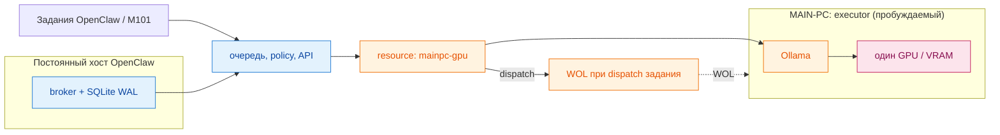

# Локальный брокер инференса

Это приватный control plane для одного GPU-хоста с Ollama. Брокер предотвращает
конкуренцию локальных задач за VRAM и предоставляет durable FIFO-очередь с
weighted scheduling по источникам. Это изолированный MVP: он не меняет текущих callers, трафик,
маршрутизацию, production-конфигурацию или порядок source roots.

## Назначение

Ollama хранит веса моделей, но каждый параллельный запрос использует собственный
KV cache и буферы генерации либо изображений. При больших контекстах или смене
модели это может исчерпать VRAM. Брокер является единой точкой admission для
локального инференса: callers ставят задания в очередь, а не вызывают Ollama
напрямую.

```text
Постоянный хост OpenClaw: broker + SQLite WAL      MAIN-PC: executor Ollama
Задания OpenClaw / M101 ──> очередь, policy, API ──> Ollama ──> один GPU / VRAM
                              resource: mainpc-gpu       ^
                                                   WOL при dispatch задания
```



Cloud-routed нагрузки, CPU-задачи и существующие GPU-workers Whisper остаются
вне этого пути. Брокер запускается вне MAIN-PC, поэтому его очередь переживает
WOL cycle; MAIN-PC не хранит состояние очереди.

## API MVP

Запускайте только в лабораторной или staging-среде:

```bash
MAINPC_MAC=2c:f0:5d:74:6a:44 python -m broker
```

По умолчанию сервер слушает localhost и не изменяет конфигурации OpenClaw,
Ollama, Shutterstock, M101 или MAIN-PC.

### Локальный user-service: admission без dispatch

В `systemd/ollama-inference-broker.service` намеренно зафиксированы loopback
`127.0.0.1:8088`, локальный SQLite в `~/.local/state/ollama-inference-broker`
и `BROKER_DISPATCH_ENABLED=false`. В таком режиме service переживает сбой,
принимает и устойчиво сохраняет jobs, но не запускает dispatcher: WOL, `/api/ps`
и любой запрос к MAIN-PC/Ollama невозможны. Это безопасный deployment state до
отдельного разрешения на canary dispatch.

```bash
install -d -m 0700 ~/.local/state/ollama-inference-broker
python3 -c 'import pathlib,secrets; pathlib.Path.home().joinpath(".local/state/ollama-inference-broker/storage-api.token").open("x",encoding="utf-8").write(secrets.token_urlsafe(48)+"\n")'
chmod 0600 ~/.local/state/ollama-inference-broker/storage-api.token
install -D -m 0644 systemd/ollama-inference-broker.service \
  ~/.config/systemd/user/ollama-inference-broker.service
systemctl --user daemon-reload
systemctl --user enable --now ollama-inference-broker.service
curl --fail http://127.0.0.1:8088/healthz
```

Rollback: `systemctl --user disable --now ollama-inference-broker.service`.
Удаление SQLite state не требуется для остановки и должно выполняться только
после отдельной проверки queued jobs.

- `POST /v1/jobs` принимает `{ "profile":"interactive", "kind":"chat|generate", "payload":{...} }` и возвращает сохранённое задание (`202`).
- `GET /v1/jobs/{id}`, `POST /v1/jobs/{id}/cancel` и `GET /v1/metrics` дают доступ к жизненному циклу и данным MAIN-PC `/api/ps`. Для producer-storage jobs чтение, cancel и retry требуют owner-only storage bearer token; legacy jobs сохраняют прежний контракт.
- `GET /v1/analytics`, `/v1/audit-events`, `/v1/jobs/{id}/attempts` и
  `/v1/correlations` дают payload-free историю очереди, попыток, correlation и
  scheduler fairness. Определения метрик и пример 8:3 — в
  [docs/ANALYTICS.md](docs/ANALYTICS.md).
- `GET /dashboard` — локальная HTML-панель очереди с refresh раз в 30 секунд,
  ETag/304 для неизменившегося состояния и без payload,
  результатов и ошибок. Она показывает policy (`enabled`, `weight`),
  состояния, lease, retry/delay, активные jobs, completed total/1h/24h и
  read-only **Forecast** под активными jobs: текущую модель и список следующих
  десяти выборов тех же model-aware time batches с configured Weight. Forecast помечен как
  contingent: он меняется при новых admissions, завершениях и hot reload
  policy, и никогда не мутирует очередь/leases/аккумуляторы. Машинный
  payload-free снимок доступен как `GET /v1/dashboard` (тот же `forecast`),
  отдельно — `GET /v1/forecast`. После запуска
  broker откройте `http://127.0.0.1:8088/dashboard` (или его настроенный host
  и port). Снимок содержит `observation.state`: `live` — текущие данные,
  `stale` — последний успешный снимок при временно недоступном observer-read,
  `unavailable` — HTTP 503 без вымышленных нулевых счётчиков. `dead` всегда
  ноль: в текущей модели broker исчерпанная работа —
  terminal `failed`, отдельного state `dead` нет.
- `GET /v1/forecast` — read-only проекция ближайших выборов scheduler
  (bounded, по умолчанию 10, максимум 20): текущая модель и следующие
  selections с source/model/weight/mode/reason/wait. Проекция
  не пишет в БД и не меняет состояние scheduler; при занятой БД возвращает
  `unavailable` вместо вымышленной пустоты.
- `GET /healthz` проверяет только локальное состояние broker: очередь, активную lease и timestamp. Он не отправляет WOL и не обращается к MAIN-PC/Ollama.
- `/api/chat` и `/api/generate` реализуют локальный compatibility contract:
  обязателен server-side `profile`, а `stream=true` возвращает NDJSON admission
  frame. Endpoint только ставит job в очередь и не dispatch-ит его; реальный
  model output не обещается до отдельной integration/canary фазы.
- `POST /v1/shutterstock-canary/generate` — отдельный синхронный VLM contract
  для canary: принимает совместимые с Ollama `prompt`, base64 `images` и JSON
  Schema в `format`, а после terminal completion возвращает исходный JSON-ответ
  Ollama плюс `broker.job_id` для наблюдения job lifecycle. Он не запускает dispatcher сам: без отдельного allowlist job остаётся
  durable `queued`, а HTTP-запрос завершится timeout.

Сервер сам выбирает профиль, модель, контекст, лимит вывода и keepalive.
Переданные caller значения `model`, `num_ctx`, `num_predict` и `keep_alive` не
могут повысить эти лимиты. SQLite использует WAL. Без source policy dispatch
выполняется в глобальном FIFO-порядке; с policy — по weight источника и FIFO
внутри выбранного источника.

Каждое принятое задание и scheduler decision сохраняются в durable
audit/attempt history. `POST /v1/jobs` опционально принимает
`source_item_id`/`external_id`; private payload и значения correlation не
копируются в structured logs. `external_id` остаётся idempotency key только для
специализированных Olya/Syncopia contracts и producer-storage jobs; остальные
legacy sources могут независимо принять несколько jobs с одним значением.
Существующие request/response поля не удалены.

Рабочий source `shutterstock` намеренно не имеет broker profile и не может
получить lease. Новый `shutterstock-canary` — отдельное имя source, а не
переименование или включение рабочего Shutterstock. Он использует
`qwen3-vl:30b` с максимум четырьмя изображениями, суммарно 8 MiB decoded,
JSON Schema до 16 KiB, concurrency `1`, не чаще одного job в 60 секунд и
server-side timeout 300 секунд. `shutterstock-video` — отдельный локальный workload на
`nemotron3:33b`. Ключ `olya` — только имя источника, а не интеграция. Job
admission не принимает scheduling-параметров: source weight задаётся только
runtime policy.

При смене модели broker будит MAIN-PC, читает `/api/ps`, выгружает несовместимую
модель, запрашивает и проверяет готовность целевой модели и только затем
запускает задание. Просроченная running lease возвращается в очередь при
перезапуске broker.

`OLLAMA_TIMEOUT_SECONDS` задаёт предел одного вызова Ollama; production unit
использует 300 секунд, чтобы холодная загрузка большой модели не превращалась в
ложную terminal failure через короткий HTTP timeout.

Если `BROKER_DISPATCH_ENABLED=true`, обязательно задаётся непустой
`BROKER_DISPATCH_SOURCES` с точными именами источников через запятую. Dispatcher
берёт lease только у заданий из этого allowlist; все остальные задания остаются
durable `queued`. Это позволяет включить обратимый pilot без миграции либо
активации других callers.

### Runtime source policy (веса без рестарта)

Вместо статичного env-allowlist можно включить weighted scheduler через
`BROKER_SOURCES_POLICY=<path.json>`. Файл читается на каждом dispatch-шаге и
перечитывается при изменении mtime (атомарная замена temp+rename), поэтому
добавление/удаление источников и изменение весов не требуют остановки
сервиса или drain очереди; queued/in-flight jobs остаются durable.

```json
{
  "version": 1,
  "sources": {
    "shutterstock-video": {"enabled": true, "admission_allowed": true, "weight": 2.0},
    "pilot-mainpc":      {"enabled": true, "admission_allowed": true, "weight": 1.0}
  }
}
```

При наличии policy scheduler строит повторяющийся 60-минутный execution-time
horizon для готовых FIFO heads, сгруппированных по `(source, target model)`.
Weight — прямая доля времени: при готовых Olya Vision / Gemma `10` и
Shutterstock Video / Nemotron `8` их budgets равны `10/18` = 33m20s и
`8/18` = 26m40s. Внутри source сохраняется FIFO, а одинаковые target model
исполняются непрерывным batch, чтобы не unload/load модель после каждого job.
Job не preempt-ится: целиком измеренное `finished - started` списывается с
текущего batch, поэтому последний job вправе пересечь его границу. Если lane
пуста, disabled или временно не eligible, другой ready lane берёт capacity;
вернувшаяся lane получает долю оставшегося horizon на ближайшей job boundary.

### Safe dispatcher drain

Для lossless drain dispatcher используйте только:

```bash
systemctl --user reload ollama-inference-broker.service
```

`ExecReload` посылает `SIGUSR1` исключительно broker `MainPID`: новые claims
останавливаются, HTTP admissions и текущий inference продолжаются до обычного
завершения. Не используйте `systemctl --user kill -s SIGUSR1 …`: по умолчанию
эта команда сигнализирует весь service cgroup, включая дочерний `curl` активного
inference, и может прервать job.

Источники делят GPU через model-affine weighted time batches; hard eligibility
включает FIFO, per-source concurrency и min-interval backpressure. Время
учитывается по исполнению, а не по числу jobs; waiting time не вызывает
preemption.
Итоговый allowlist берётся из `enabled`-записей файла, а не из env.
`GET /v1/sources` отдаёт текущий снапшот политики (без секретов). При
отсутствии policy поведение — env-allowlist + global FIFO.

### Runtime controls: dispatch и admission — разные состояния

`enabled=false` означает **dispatch pause**: уже queued jobs не меняются,
текущий running job не прерывается, но после его завершения source не получает
новую lease. `POST /v1/sources/{source}/dispatch` принимает только
`{"paused":true|false}`; старый `POST .../enabled` сохраняется без изменения
контракта. Resume применяется на следующем scheduler tick без рестарта.

`admission_allowed=false` означает **admission block**: все HTTP endpoints,
которые создают job для этого source, отклоняются до durable job insert с HTTP
`403` и `error.code="source_admission_blocked"`. Существующая очередь и running
job не меняются. Поле обратно совместимо: если `admission_allowed` отсутствует
(или source отсутствует в policy), admission разрешён. Управление:
`POST /v1/sources/{source}/admission` с `{"allowed":true|false}`.

Bulk operations требуют точное имя configured source и серверное подтверждение
`{"confirm":true}`:

- `POST /v1/sources/{source}/queued/cancel` переводит только `queued` этого
  source в `cancelled` и возвращает `cancelled` count;
- `POST /v1/sources/{source}/failed/retry` переводит только `failed` этого
  source в новый dispatchable `queued`, увеличивает `retry_count`, сохраняет
  `attempt_count`, `job_attempts` и audit history и возвращает `retried` count.

Обе операции транзакционны, идемпотентны при повторе и не затрагивают jobs
другого source либо состояния `running`, `cancel_requested`, `completed` и
`cancelled`. Каждая policy mutation сериализована, записывается через
fsync + atomic rename + directory fsync и hot-reloadится. Dashboard показывает
Dispatch, Admission, counts и подтверждение перед bulk-действиями. Audit events
содержат только source/job/state/count metadata — payload, result, correlation
values и error text в control events не копируются.

Канонический production policy хранится в `config/sources.production.json`:
веса Shutterstock Video / Olya Vision / Olya Decision остаются `3/8/6`, а
отдельный source `syncopia-telegram-memory` имеет scheduler weight ровно `4`.
`weight` — единственный scheduling-параметр: он задаёт прямую долю source в
time-batch scheduler. Policy с неизвестным ключом отклоняется, чтобы конфигурация не могла
молча стать default `1.0`.

### Producer-owned storage: additive safe rollout

Broker поддерживает opt-in capability `producer_storage` при `POST /v1/jobs`,
payload-free `GET /v1/jobs/{id}/status`, durable result receipt через
`POST /v1/jobs/{id}/ack` и recovery через `GET /v1/jobs/{id}/receipt`.
`GET /v1/jobs/{id}` сохраняет прежнюю форму ответа, но completed payload после
исполнения равен `{}`: identity/hash/bytes остаются в metadata. Result доступен
до producer ACK/compaction либо до явного broker-temporary TTL. Для
producer-storage job endpoint требует тот же owner-only bearer token. Без
токена history/audit/correlation reads исключают такие jobs и их storage
evidence; legacy jobs остаются доступны как прежде до окончания их TTL.

Production policy allowlist уже описывает допустимый storage mode каждого
известного producer, но безопасные начальные флаги остаются
`ack_required=false`, `compaction_enabled=false` и
`legacy_result_fallback=true`. Поэтому deployment схемы и receipt API сам по
себе не удаляет данные. Quarantine/compaction требует отдельного source-scoped
переключения всех guard-флагов, matching ACK и двух grace periods.

Retention-bounded режим также opt-in: `retention_enabled=false` по умолчанию.
Он добавляет конечные TTL, source byte budget, bounded maintenance и
idempotency tombstones. Queued/running/retryable payload остаётся inline;
completed payload очищается после execution, broker-temporary result — после
явного TTL, producer-owned result — только после durable ACK. Физический
repack всегда создаётся в новом SQLite-файле, live DB не вакуумится на месте.

WAL ограничивается `wal_autocheckpoint=4096`,
`journal_size_limit=67108864`, alert budget 128 MiB и периодическим
`PASSIVE` checkpoint. Текущая политика и метрики доступны через
`GET /v1/storage/health`; точный контракт, migration copy tooling и
lossless rollout/rollback описаны в
[docs/PRODUCER_STORAGE.md](docs/PRODUCER_STORAGE.md).

### User-facing Weight (1 lowest … 10 highest)

Weight — единственный soft scheduling input. **10 — самая большая доля
execution time, 1 — самая маленькая**. Weight не является deadline и не
меняется с возрастом job.

`POST /v1/shutterstock-video/generate` — синхронный bounded контракт локального
видео-чанка (profile `shutterstock-video`, `nemotron3:33b`): принимает `prompt`,
base64 `images` (до 12 кадров, 32 MiB) и JSON Schema в `format` (до 32 KiB),
возвращает результат Ollama плюс `broker.job_id`. Dispatch источника включается
только через policy/allowlist; без этого job остаётся durable `queued`.

`POST /v1/olya-vision/generate` — синхронный photos-only контракт источника
`olya-vision`: принимает только `gemma4:12b` или `qwen3-vl:30b`, до 16
base64-изображений (64 MiB), JSON Schema (64 KiB) и correlation
`source_item_id`/`external_id`. Повтор того же `external_id` возвращает
существующий durable job; результат и attempt history переживают restart.
Runtime-параметры моделей задаёт broker, caller не может их расширить.

`POST /v1/olya-decision/generate` — отдельный синхронный text-only contract
`olya-decision`. Он принимает fixed decision prompt и JSON Schema, но запускает
только server-owned `qwen3.8:ad-iq2-xs` с bounded context/output и `think=low`.
`source_item_id` связывает recommendation с broker job, стабильный `external_id`
обеспечивает idempotent resume. Этот source независим от `olya-vision`.

`POST /v1/syncopia-memory/extract` — отдельный синхронный text-only contract
для локального Phase-2 extractor. Он требует `tools=[]`, `stream=false`, ровно
system+user messages, запускает только
`qwen3.8:ad-iq2-xs` с `num_ctx=65536`, `num_predict=8192` и source
`syncopia-telegram-memory`. Request hash используется caller как idempotency
key; Olya/Shutterstock endpoints и profiles не переиспользуются.

Для свободной текстовой сводки на том же `syncopia-memory-qwen38` необходимо
**не передавать** оба поля `format`/`response_format` и задать `think="low"`.
Этот явный freeform mode не добавляет JSON forcing, не усекает messages и
передаёт `think="low"` в Ollama. Лимиты и options остаются теми же:
`temperature=0`, `num_ctx=65536`, `num_predict=8192`; сообщения свыше 196608
UTF-8 JSON bytes отклоняются, а не обрезаются. Schema mode по-прежнему требует
`format` как JSON Schema object, допускает отсутствующий/`null` response_format
или `{"type":"json_object"}` и принудительно использует `think=false`.
Null/частичные format-поля не выбирают freeform mode. Оба режима поддерживаются
также через `POST /v1/jobs` на выделенных profile/source; producer-storage
требует прежний bearer, canonical normalized input hash и ACK, без изменения
storage identity или правил защиты.

## Проверка и разработка

Безопасная canary-проверка использует mock или staging задания `interactive`,
`cron`, `shutterstock` и `olya`. Следует проверить один удалённый запрос за раз,
weighted source selection/FIFO, WOL/readiness, unload перед
сменой модели, восстановление просроченной lease и отмену queued задания.
Ни один live caller не мигрируется до успешной проверки; откат — остановить
broker без изменения routes.

### Planned VLM canary rollout (not executed by this change)

Перед единственным реальным запросом оператор должен убедиться, что
`qwen3-vl:30b` установлен на MAIN-PC, временно добавить **только**
`shutterstock-canary` в `BROKER_DISPATCH_SOURCES`, перезапустить user-service
и отправить один bounded image+schema request на endpoint выше. Проверяются
`queued → running → completed`, сохранённый `result` по `GET /v1/jobs/{id}` и
состояние после service restart. Откат: удалить `shutterstock-canary` из
allowlist (либо выключить dispatch), выполнить `daemon-reload` и restart
service; source `shutterstock` при этом не добавляется никогда. Это изменение
не выполняет ни один из этих шагов.

Перед live canary оператор обязан проверить, что на MAIN-PC уже установлены
все модели server-side local-GPU profiles. Для `shutterstock-video` нужна
`nemotron3:33b`; cloud photo через OmniRoute этой проверки не требует и в
broker не подключается. Если целевой модели нет в `/api/tags`, canary
прекращается до dispatch, WOL, unload или попытки pull модели.

```bash
python -m unittest discover -s tests -v
```

Тесты используют адаптеры-заглушки и не отправляют WOL либо запросы Ollama.

## Границы MVP

Broker владеет admission, порядком, residency моделей, request profiles и
операционной телеметрией. Ollama остаётся inference runtime. Проект не заменяет
cloud routing, task orchestration или бизнес-логику callers.

Подробный поэтапный план — в [ROADMAP.md](ROADMAP.md).

### OpenClaw agentTurn через durable queue (opt-in)

Broker route `POST /openclaw/api/chat` реализует **нативный Ollama chat** для
выбранных OpenClaw turns. Это отдельный путь: старые `/api/chat` и
`/api/generate` остаются асинхронными admission-only endpoints с ответом `202`.
Провайдер OpenClaw использует `api: "ollama"` и `baseUrl` вида
`http://127.0.0.1:8088/openclaw`; OpenClaw добавляет `/api/chat`. Внутренний
broker source остаётся `openclaw` при любом OpenClaw-facing provider key.
Wire model обязан совпадать с одним из восьми server-owned профилей:

| Wire model | Broker profile | Context/output | Image |
| --- | --- | --- | --- |
| `gemma4:12b` | `openclaw-gemma4` | 262144/16384 | yes |
| `qwen3-vl:30b` | `openclaw-qwen3-vl` | 212992/16384 | yes |
| `nemotron3:33b` | `openclaw-nemotron3` | 131072/8192 | yes |
| `qwen3.8:ad-iq2-xs` | `openclaw` (legacy queue compatibility) | 131072/16384 | no |
| `qwen3.8:unc-rvn-iq2xxs` | `openclaw-unc-rvn-iq2xxs` | 131072/16384 | no |
| `frob/ministral-3:14b-thinking-q4_K_M` | `openclaw-ministral3` | 262144/16384 | yes |
| `nemotron-3-nano:30b-a3b-q4_K_M` | `openclaw-nemotron-nano` | 262144/16384 | no |
| `gpt-oss:20b` | `openclaw-gpt-oss` | 131072/16384 | no |

Limits and modalities match the eight configured `ollama-main-pc` model entries
at implementation time. Each profile pins model, keepalive 300 s and executor
timeout 900 s. Admission preserves up to 512 messages and 128 tools. Text JSON
requests are limited to 2 MiB; vision requests to 32 MiB, at most 16 images
and 24 MiB decoded images. Tools are limited to 512 KiB. Byte limits protect
SQLite/HTTP and can narrow oversized image turns; exact token budget
остаётся ответственностью OpenClaw/Ollama, поэтому `truncate` и `shift`
запрещены. Queue admission ограничен восемью незавершёнными jobs и восемью
одновременными HTTP waiters; сверх лимита — HTTP 429. Запросы проходят обычный
source scheduler, model switch и durable result storage; route не вызывает
Ollama напрямую.

`stream=false` возвращает настоящий Ollama JSON после terminal completion.
`stream=true` возвращает Ollama NDJSON: пустые heartbeat-кадры примерно каждые
2 s во время queue/model wait и один итоговый `done=true` кадр с text,
thinking, tool calls и usage. Это корректный поток для OpenClaw agentTurn,
но **не** progressive token streaming: executor получает целый non-stream
ответ Ollama до записи durable result. `Idempotency-Key` (опциональный HTTP
header, не генерируется OpenClaw автоматически) привязывает повтор к тому же
job и отвергает другое содержимое с HTTP 400. При отключении клиента без ключа
queued job отменяется, running получает `cancel_requested` и освобождает GPU
после возврата Ollama; с ключом durable job остаётся доступным для повторного
ожидания. Время ожидания HTTP — 1800 s, затем HTTP 504 / NDJSON error; для
keyed request job сохраняется. Для OpenClaw provider timeout нужен >1800 s,
а timeout выбранного cron agentTurn также должен покрывать очередь и inference.

Перед rollout main/ops отдельно добавляет `openclaw` в **live** source policy с
нужными `enabled`, `admission_allowed` и weight, обновляет broker release и
переключает OpenClaw provider/models. Ни код, ни этот документ не меняют live
policy или automations. Rollback: вернуть прежний provider/model routing,
закрыть admission для `openclaw`, дождаться/отменить его
jobs и вернуть прежний broker release; другие sources и SQLite не удалять.
