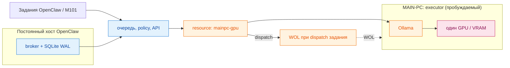

# Локальный брокер инференса

Это приватный control plane для одного GPU-хоста с Ollama. Брокер предотвращает
конкуренцию локальных задач за VRAM и предоставляет durable FIFO-очередь с
weighted scheduling по источникам. Это изолированный MVP: он не меняет текущих callers, трафик,
маршрутизацию, production-конфигурацию или порядок source roots.

## Назначение

Ollama хранит веса моделей, но каждый параллельный запрос использует собственный
KV cache и буферы генерации либо изображений. При больших контекстах или смене
модели это может исчерпать VRAM. Брокер является единой точкой admission для
локального инференса: callers ставят задания в очередь, а не вызывают Ollama
напрямую.

```text
Постоянный хост OpenClaw: broker + SQLite WAL      MAIN-PC: executor Ollama
Задания OpenClaw / M101 ──> очередь, policy, API ──> Ollama ──> один GPU / VRAM
                              resource: mainpc-gpu       ^
                                                   WOL при dispatch задания
```



Cloud-routed нагрузки, CPU-задачи и существующие GPU-workers Whisper остаются
вне этого пути. Брокер запускается вне MAIN-PC, поэтому его очередь переживает
WOL cycle; MAIN-PC не хранит состояние очереди.

## API MVP

Запускайте только в лабораторной или staging-среде:

```bash
MAINPC_MAC=2c:f0:5d:74:6a:44 python -m broker
```

По умолчанию сервер слушает localhost и не изменяет конфигурации OpenClaw,
Ollama, Shutterstock, M101 или MAIN-PC.

### Локальный user-service: admission без dispatch

В `systemd/ollama-inference-broker.service` намеренно зафиксированы loopback
`127.0.0.1:8088`, локальный SQLite в `~/.local/state/ollama-inference-broker`
и `BROKER_DISPATCH_ENABLED=false`. В таком режиме service переживает сбой,
принимает и устойчиво сохраняет jobs, но не запускает dispatcher: WOL, `/api/ps`
и любой запрос к MAIN-PC/Ollama невозможны. Это безопасный deployment state до
отдельного разрешения на canary dispatch.

```bash
install -D -m 0644 systemd/ollama-inference-broker.service \
  ~/.config/systemd/user/ollama-inference-broker.service
systemctl --user daemon-reload
systemctl --user enable --now ollama-inference-broker.service
curl --fail http://127.0.0.1:8088/healthz
```

Rollback: `systemctl --user disable --now ollama-inference-broker.service`.
Удаление SQLite state не требуется для остановки и должно выполняться только
после отдельной проверки queued jobs.

- `POST /v1/jobs` принимает `{ "profile":"interactive", "kind":"chat|generate", "payload":{...} }` и возвращает сохранённое задание (`202`).
- `GET /v1/jobs/{id}`, `POST /v1/jobs/{id}/cancel` и `GET /v1/metrics` дают доступ к жизненному циклу и данным MAIN-PC `/api/ps`.
- `GET /v1/analytics`, `/v1/audit-events`, `/v1/jobs/{id}/attempts` и
  `/v1/correlations` дают payload-free историю очереди, попыток, correlation и
  scheduler fairness. Определения метрик и пример 8:3 — в
  [docs/ANALYTICS.md](docs/ANALYTICS.md).
- `GET /dashboard` — локальная auto-refresh HTML-панель очереди без payload,
  результатов и ошибок. Она показывает policy (`enabled`, `weight`),
  состояния, lease, retry/delay, активные jobs и completed total/1h/24h.
  Машинный payload-free снимок доступен как `GET /v1/dashboard`. После запуска
  broker откройте `http://127.0.0.1:8088/dashboard` (или его настроенный host
  и port). Снимок содержит `observation.state`: `live` — текущие данные,
  `stale` — последний успешный снимок при временно недоступном observer-read,
  `unavailable` — HTTP 503 без вымышленных нулевых счётчиков. `dead` всегда
  ноль: в текущей модели broker исчерпанная работа —
  terminal `failed`, отдельного state `dead` нет.
- `GET /healthz` проверяет только локальное состояние broker: очередь, активную lease и timestamp. Он не отправляет WOL и не обращается к MAIN-PC/Ollama.
- `/api/chat` и `/api/generate` реализуют локальный compatibility contract:
  обязателен server-side `profile`, а `stream=true` возвращает NDJSON admission
  frame. Endpoint только ставит job в очередь и не dispatch-ит его; реальный
  model output не обещается до отдельной integration/canary фазы.
- `POST /v1/shutterstock-canary/generate` — отдельный синхронный VLM contract
  для canary: принимает совместимые с Ollama `prompt`, base64 `images` и JSON
  Schema в `format`, а после terminal completion возвращает исходный JSON-ответ
  Ollama плюс `broker.job_id` для наблюдения job lifecycle. Он не запускает dispatcher сам: без отдельного allowlist job остаётся
  durable `queued`, а HTTP-запрос завершится timeout.

Сервер сам выбирает профиль, модель, контекст, лимит вывода и keepalive.
Переданные caller значения `model`, `num_ctx`, `num_predict` и `keep_alive` не
могут повысить эти лимиты. SQLite использует WAL. Без source policy dispatch
выполняется в глобальном FIFO-порядке; с policy — по weight источника и FIFO
внутри выбранного источника.

Каждое принятое задание и scheduler decision сохраняются в durable
audit/attempt history. `POST /v1/jobs` опционально принимает
`source_item_id`/`external_id`; private payload и значения correlation не
копируются в structured logs. Существующие request/response поля не удалены.

Рабочий source `shutterstock` намеренно не имеет broker profile и не может
получить lease. Новый `shutterstock-canary` — отдельное имя source, а не
переименование или включение рабочего Shutterstock. Он использует
`qwen3-vl:30b` с максимум четырьмя изображениями, суммарно 8 MiB decoded,
JSON Schema до 16 KiB, concurrency `1`, не чаще одного job в 60 секунд и
server-side timeout 300 секунд. `shutterstock-video` — отдельный локальный workload на
`nemotron3:33b`. Ключ `olya` — только имя источника, а не интеграция. Job
admission не принимает scheduling-параметров: source weight задаётся только
runtime policy.

При смене модели broker будит MAIN-PC, читает `/api/ps`, выгружает несовместимую
модель, запрашивает и проверяет готовность целевой модели и только затем
запускает задание. Просроченная running lease возвращается в очередь при
перезапуске broker.

`OLLAMA_TIMEOUT_SECONDS` задаёт предел одного вызова Ollama; production unit
использует 300 секунд, чтобы холодная загрузка большой модели не превращалась в
ложную terminal failure через короткий HTTP timeout.

Если `BROKER_DISPATCH_ENABLED=true`, обязательно задаётся непустой
`BROKER_DISPATCH_SOURCES` с точными именами источников через запятую. Dispatcher
берёт lease только у заданий из этого allowlist; все остальные задания остаются
durable `queued`. Это позволяет включить обратимый pilot без миграции либо
активации других callers.

### Runtime source policy (веса без рестарта)

Вместо статичного env-allowlist можно включить weighted scheduler через
`BROKER_SOURCES_POLICY=<path.json>`. Файл читается на каждом dispatch-шаге и
перечитывается при изменении mtime (атомарная замена temp+rename), поэтому
добавление/удаление источников и изменение весов не требуют остановки
сервиса или drain очереди; queued/in-flight jobs остаются durable.

```json
{
  "version": 1,
  "sources": {
    "shutterstock-video": {"enabled": true, "weight": 2.0},
    "pilot-mainpc":      {"enabled": true, "weight": 1.0}
  }
}
```

Выбор при наличии policy: источники делят GPU пропорционально весам (weighted
round-robin с вращающимся аккумулятором); внутри каждого источника сохраняется
FIFO, per-source concurrency и min-interval
backpressure. Итоговый allowlist берётся из `enabled`-записей файла, а не из
env. `GET /v1/sources` отдаёт текущий снапшот политики (без секретов). При
отсутствии policy поведение — env-allowlist + global FIFO.

Канонический production policy хранится в `config/sources.production.json`:
веса Shutterstock Video / Olya Vision / Olya Decision остаются `3/8/6`, а
отдельный source `syncopia-telegram-memory` имеет scheduler weight ровно `4`.
`weight` — единственный scheduling-параметр: он задаёт долю source в weighted
scheduler. Policy с неизвестным ключом отклоняется, чтобы конфигурация не могла
молча стать default `1.0`.

`POST /v1/shutterstock-video/generate` — синхронный bounded контракт локального
видео-чанка (profile `shutterstock-video`, `nemotron3:33b`): принимает `prompt`,
base64 `images` (до 12 кадров, 32 MiB) и JSON Schema в `format` (до 32 KiB),
возвращает результат Ollama плюс `broker.job_id`. Dispatch источника включается
только через policy/allowlist; без этого job остаётся durable `queued`.

`POST /v1/olya-vision/generate` — синхронный photos-only контракт источника
`olya-vision`: принимает только `gemma4:12b` или `qwen3-vl:30b`, до 16
base64-изображений (64 MiB), JSON Schema (64 KiB) и correlation
`source_item_id`/`external_id`. Повтор того же `external_id` возвращает
существующий durable job; результат и attempt history переживают restart.
Runtime-параметры моделей задаёт broker, caller не может их расширить.

`POST /v1/olya-decision/generate` — отдельный синхронный text-only contract
`olya-decision`. Он принимает fixed decision prompt и JSON Schema, но запускает
только server-owned `qwen3.8:ad-iq2-xs` с bounded context/output и `think=low`.
`source_item_id` связывает recommendation с broker job, стабильный `external_id`
обеспечивает idempotent resume. Этот source независим от `olya-vision`.

`POST /v1/syncopia-memory/extract` — отдельный синхронный text-only contract
для локального Phase-2 extractor. Он требует `tools=[]`, `stream=false`, ровно
system+user messages и JSON Schema, запускает только
`qwen3.8:ad-iq2-xs` с `num_ctx=65536`, `num_predict=8192`, `think=false` и source
`syncopia-telegram-memory`. Request hash используется caller как idempotency
key; Olya/Shutterstock endpoints и profiles не переиспользуются.

## Проверка и разработка

Безопасная canary-проверка использует mock или staging задания `interactive`,
`cron`, `shutterstock` и `olya`. Следует проверить один удалённый запрос за раз,
weighted source selection/FIFO, WOL/readiness, unload перед
сменой модели, восстановление просроченной lease и отмену queued задания.
Ни один live caller не мигрируется до успешной проверки; откат — остановить
broker без изменения routes.

### Planned VLM canary rollout (not executed by this change)

Перед единственным реальным запросом оператор должен убедиться, что
`qwen3-vl:30b` установлен на MAIN-PC, временно добавить **только**
`shutterstock-canary` в `BROKER_DISPATCH_SOURCES`, перезапустить user-service
и отправить один bounded image+schema request на endpoint выше. Проверяются
`queued → running → completed`, сохранённый `result` по `GET /v1/jobs/{id}` и
состояние после service restart. Откат: удалить `shutterstock-canary` из
allowlist (либо выключить dispatch), выполнить `daemon-reload` и restart
service; source `shutterstock` при этом не добавляется никогда. Это изменение
не выполняет ни один из этих шагов.

Перед live canary оператор обязан проверить, что на MAIN-PC уже установлены
все модели server-side local-GPU profiles. Для `shutterstock-video` нужна
`nemotron3:33b`; cloud photo через OmniRoute этой проверки не требует и в
broker не подключается. Если целевой модели нет в `/api/tags`, canary
прекращается до dispatch, WOL, unload или попытки pull модели.

```bash
python -m unittest discover -s tests -v
```

Тесты используют адаптеры-заглушки и не отправляют WOL либо запросы Ollama.

## Границы MVP

Broker владеет admission, порядком, residency моделей, request profiles и
операционной телеметрией. Ollama остаётся inference runtime. Проект не заменяет
cloud routing, task orchestration или бизнес-логику callers.

Подробный поэтапный план — в [ROADMAP.md](ROADMAP.md).
